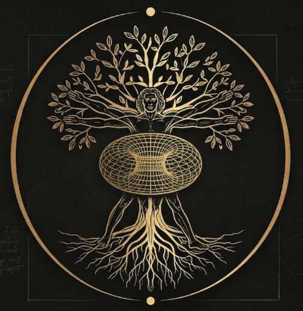

<p align="center">
  
</p>

<h1 align="center">De Materia Vitae</h1>

<p align="center">
  <strong>The Body Manual</strong> — ancient wisdom, modern evidence, daily practice.
</p>

<p align="center">
  <a href="LICENSE"></a>
  
  
  
  
</p>

<p align="center">
  <em>What the greatest physicians of antiquity knew, what modern science has confirmed, and what you should actually do about it — starting today.</em>
</p>

---

## What Is This?

An open-source, evidence-graded, living document for maintaining a human body.

Not a diet book. Not a biohacking blog. Not a medical textbook. Something between all three: **a practical operating manual** built on two foundations that most health advice lacks:

1. **Ancient source authority** — Dioscorides' *De Materia Medica* (60 AD), Hippocrates' *Regimen*, Avicenna's *Canon of Medicine* (1025), the *Shennong Bencao Jing* (200 AD), the *Charaka Samhita* (400 BC). These weren't guessing. They had millennia of observation.
2. **Modern evidence standards** — Every claim is backed by PubMed-indexed research, Cochrane reviews, WHO guidelines, or meta-analyses. We grade the evidence transparently.

If something appears here, it has **both** — or it doesn't appear at all.

---

## Philosophy

- **Compounding, not perfection.** Small daily practices, stacked over decades. That's the entire game.
- **Ancient + modern, not either/or.** If garlic worked for parasites for 2,000 years and one RCT confirms it, that's not "just tradition" — that's a replicated observation across civilizations.
- **Transparent uncertainty.** We tell you exactly what's proven, what's plausible, and what's traditional. No hype.
- **Accessible to everyone.** Three budget tiers with PPP-adjusted pricing so whether you're in Mumbai, Milan, or Minneapolis, you know what this costs in your reality.
- **Action over reading.** This is a decision tree, not a bibliography. You open it, answer a few questions, and get a protocol.

---

## Start Here: Decision Tree

```
What do you want to optimize for?
│
├── A. "I want to live longer and healthier" → HEALTHSPAN FOUNDATION
│   Start with: Nutrition (1-8) + Movement (9-10) + Sleep (13)
│   Add after 30 days: Stress (14) + Fasting (15) + Environment (11-12)
│   Maintain: Deworming (16) quarterly/biannually
│   → See protocols/01-nutrition.md through protocols/06-systemic-maintenance.md
│
├── B. "I feel like shit right now" → SYMPTOM PATH
│   │
│   ├── Chronic fatigue?
│   │   1. Check: sleep quality, iron/B12/ferritin (blood test)
│   │   2. If normal → try: deworming protocol, microbiome reset, blue light glasses
│   │   3. If persists → physician (thyroid, sleep apnea, depression screening)
│   │   → See protocols/06-systemic-maintenance.md (deworming)
│   │
│   ├── Can't sleep / poor sleep?
│   │   1. Start: blue light glasses (red lens 2-3h before bed), no caffeine after 2pm
│   │   2. Add: 10-min breathwork, consistent sleep/wake time
│   │   3. Check: room temperature (18-20°C), darkness, noise
│   │   → See protocols/03-sleep-circadian.md
│   │
│   ├── Brain fog / can't focus?
│   │   1. Start: sleep protocol (above), omega-3 (fatty fish or algal oil)
│   │   2. Add: green tea (EGCG + L-theanine), daily walking
│   │   3. If persists → deworming protocol, comprehensive stool test
│   │   → See protocols/01-nutrition.md + protocols/03-sleep-circadian.md
│   │
│   ├── Digestive issues (bloating, irregularity)?
│   │   1. Start: fermented foods daily, 30g+ fiber, eliminate ultra-processed food
│   │   2. Add: probiotic (50B CFU), L-glutamine, identify food intolerances
│   │   3. If persists → comprehensive stool test, deworming protocol
│   │   → See protocols/06-systemic-maintenance.md
│   │
│   └── Joint pain / low energy / body feels old?
│       1. Start: resistance training (2-3×/week), omega-3, daily walking
│       2. Add: EVOO as primary fat, berries daily, vitamin D check
│       3. If persists → physician (inflammatory markers, CRP, ESR)
│       → See protocols/02-movement.md + protocols/01-nutrition.md
│
├── C. "I want to be systematic about this" → FULL STACK
│   Month 1: Nutrition (all 8 items) + Movement (walking daily)
│   Month 2: Add resistance training + blue light glasses
│   Month 3: Add fasting window + meditation
│   Month 4: Add water filter + sunscreen + deworming protocol
│   Month 6: Blood work, adjust based on biomarkers
│   → See all protocols/ files, use trackers/ for logging
│
└── D. "I just want the checklist" → QUICK REFERENCE
    See the Quick Reference section at the bottom of each protocol file.

```

---

## Budget Tiers

Every protocol includes three cost tiers. We use **PPP-adjusted pricing** (Purchasing Power Parity) so the cost is fair regardless of where you live.

| Tier | Concept | What's included |
|------|---------|-----------------|
| **Foundation** | Free | Walking, sunlight, meditation, meal timing, bodyweight exercise, sleep hygiene |
| **Essential** | ~$30-60/mo (US PPP baseline) | Adds EVOO, green tea, basic supplements, water filter, blue light glasses |
| **Complete** | ~$150-300/mo (US PPP baseline) | Adds comprehensive testing, premium supplements, lab work, advanced protocols |

Your local cost = US baseline × your country's PPP factor (inverse). We provide a calculator: `tools/budget-planner.py`

**Example:** If the Essential tier is $50/mo in the US:
- 🇮🇹 Italy (PPP ~0.75): ~$38/mo equivalent
- 🇮🇳 India (PPP ~0.30): ~$15/mo equivalent
- 🇨🇭 Switzerland (PPP ~1.40): ~$70/mo equivalent

Everyone pays roughly the same *proportion* of their local purchasing power.

---

## Repository Structure

```
de-materia-vitae/
├── README.md                    ← You are here
├── CONTRIBUTING.md              ← How to add protocols, evidence standards
├── CODE_OF_CONDUCT.md
│
├── protocols/
│   ├── 01-nutrition.md          ← Olive oil, greens, fish, nuts, tea, fermented, grains, berries
│   ├── 02-movement.md           ← Resistance training, walking
│   ├── 03-sleep-circadian.md    ← Blue light glasses, sleep optimization
│   ├── 04-stress-recovery.md    ← Meditation, breathwork
│   ├── 05-environment.md        ← Water filter, sunscreen, air quality
│   ├── 06-systemic-maintenance.md ← Deworming, testing schedule
│   └── _template.md             ← Template for new protocols
│
├── evidence/
│   ├── sources.json             ← Structured evidence database (PubMed + ancient sources)
│   ├── interactions.json        ← Drug/herb/supplement interaction matrix
│   └── ancient-sources/         ← Translated excerpts from classical texts
│       ├── dioscorides-de-materia-medica.md
│       ├── hippocrates-regimen.md
│       ├── avicenna-canon-of-medicine.md
│       └── README.md
│
├── trackers/
│   ├── daily-log.csv            ← Daily health/symptom tracking
│   ├── protocol-comparison.csv  ← Before/after protocol comparison
│   └── biomarker-trends.csv     ← Blood work over time
│
├── tools/
│   ├── dose-calculator.py       ← Bodyweight-based dosing
│   ├── interaction-checker.py   ← Safe combination validator
│   └── budget-planner.py        ← PPP-adjusted cost estimator
│
├── translations/
│   ├── es/                      ← Spanish
│   ├── it/                      ← Italian
│   └── fr/                      ← French
│
└── n-of-1/
    └── README.md                ← How to submit your self-experiment results
```

---

## Evidence Grading

Every claim in this repo carries an evidence grade:

| Grade | Meaning | Example |
|-------|---------|---------|
| ★★★★★ | Multiple RCTs, meta-analyses, WHO/medical guidelines | Albendazole for parasites, EVOO for cardiovascular health |
| ★★★★☆ | At least one RCT + strong mechanistic evidence | Green tea/EGCG for metabolic health |
| ★★★☆☆ | Small human studies + consistent observational data | Garlic/allicin for Giardia clearance |
| ★★☆☆☆ | Traditional use + in vitro/animal evidence | Pumpkin seeds for helminth paralysis |
| ★☆☆☆☆ | Traditional use only, mechanistic plausibility | Black walnut hull for parasites |
| ☆☆☆☆☆ | Anecdotal only — **not included in this repo** | — |

We require **minimum ★★☆☆☆** for inclusion, AND an ancient source reference.

---

## Important Disclaimers

**This is not medical advice.** This is information. Share it with your doctor. If you have symptoms, see a physician. If you take medications, check interactions (we provide a tool: `tools/interaction-checker.py`). If you are pregnant, nursing, or have a chronic condition, consult a specialist before starting any protocol.

**We are not responsible for what you do with this information.** That's standard open-source license language, but it's also real: your body is yours, we're just sharing what we've found useful.

---

## License

[MIT License](LICENSE) — free to use, share, modify, build upon. We only ask that you credit this project and share your improvements back.

---

*"Let food be thy medicine and medicine be thy food."* — Hippocrates, ~400 BC

*"For it is the body that we must attend to first."* — The Canon of Medicine, Avicenna, 1025 AD

We're still attending to the same body. The tools just got better.
